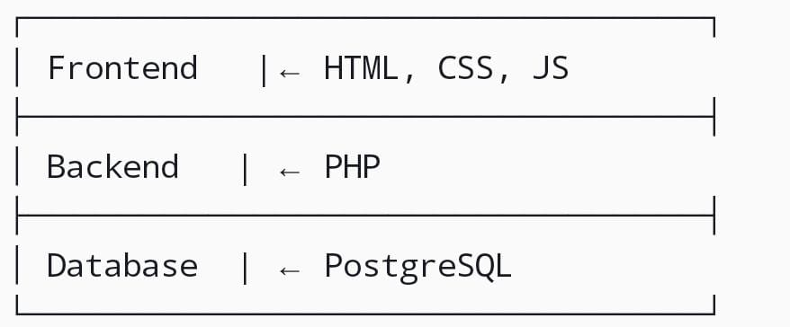

# Arquitetura do Sistema - C-Saúde

## Requisitos principais do MVP

| ID | Requisito Funcional | Mitigação |
| :--- | :--- | :--- |
| RF01 | Registro de paciente | Essencial para criar base de dados de utilizador e permitir o acesso seguro ao sistema. |
| RF03 | Agenda e Histórico Médico | Crucial para que o médico consiga ver o seu histórico de actividade, vendo somente suas agendas e históricos. |
| RF04 | Painel da Recepcionista | Permite a gestão do fluxo e atualização de estados de consulta em tempo real. |
| RF05 | Regra de marcação | Impede que o sistema aceite choques de hoararios, garantindo a integridade da agenda. |

## Escolha de Tecnologia

* **FrontEnd:** HTML, CSS, JavaScript;
* **BackEnd:** PHP;
* **Base de dados:** Postgres SQL.

## Diagrama da arquitetura

## Justificação

A escolha das duas arquiteturas deve-se a organização e manutenção, onde o MVC permite separar a interface da lógica de negócio e do acesso ao dados, e isso facilita a correção de erros sem afectar todo sistema. Também, a distribuição e segurança, onde a arquitetura em camadas separa o Front-end do BackEnd, e isso garante que as regras de negocio e os dados sensiveis dos pacientes fiquem protegidos do servidor, longe do acesso directo pelo navegador.

Sobre a tecnologia usada, temos simplicidade técnica e agilidade no cronografia eh uma tecnologia que o grupo domina. Não se é preciso configurar servidores muito complexos ou frameworks pesados, e isso ajuda a ter um sistema mais leve e funcional de boa forma aos computadores da clinica.

Para casos de lidar com formularios de marcação e notificações, visto em alguns requisitos o PHP e HTML são excelentes para isso, a parte de JS ajuda nas notificações e ações do sistema.

Sobre a seguranca, como o PHP corre no servidor, conseguimos mitigar o risco de a recepcionista ou o medico aceder função que não lhes pertence, protegendo assim os dados. O usos do PHP permite filtrar a base de dados para que o medico veja apenas a sua agenda. Com o MVC isolamos o histprico clínico no Molal, tendo a garantia que as informações sensiveis sejam carregadas de forma segura. Com HTML/CSS com JavaScript permite que actualize o estado em tempo real, a arquitetura em camada ajuda ao cancelar ou reagendar e que a base de dados seja actualiada instantaneamente sem confusão ou conflitos.
