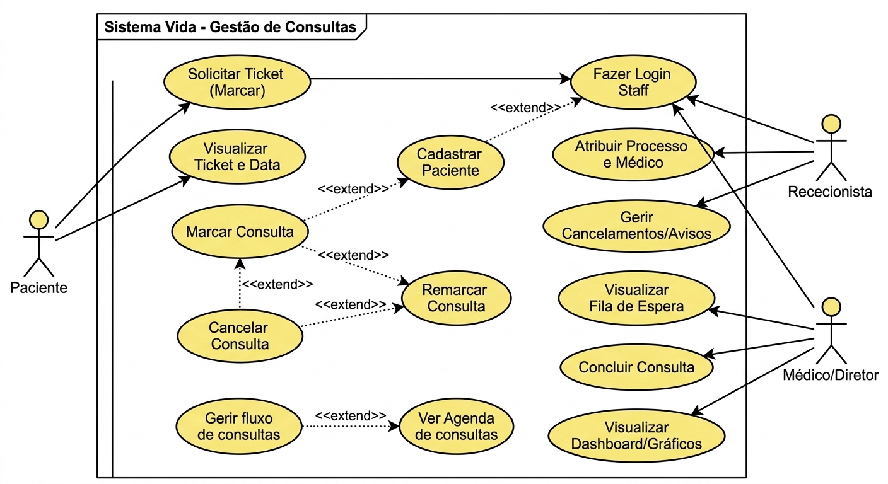

## Diagrama de caso de uso

## Especificações textuais dos Casos de Uso

Este documento detalha as interações dos atores com o sistema, focando na simplicidade para o paciente e controle total para a staff clínica.

---

### CU01: Solicitar Ticket (Marcar Consulta)
| Campo | Descrição |
| :--- | :--- |
| **Ator** | Paciente (Via Landing Page) |
| **Pré-condição** | Nenhuma (Acesso público ao formulário) |
| **Pós-condição** | Ticket gerado aleatoriamente e gravado como "Pendente" no sistema |
| **Fluxo Principal** | 1. Paciente preenche o formulário: Novo/Antigo, Data (limite 15 dias) e Urgência. 2. Sistema valida a data (não pode ser passada). 3. Sistema gera Ticket aleatório (ex: `#V-1234`). 4. Sistema grava a marcação no ficheiro `marcacao.json`. 5. Sistema exibe o Ticket num modal de sucesso. |

---

### CU03: Atribuir Processo e Médico (Confirmar Chegada)
| Campo | Descrição |
| :--- | :--- |
| **Ator** | Rececionista |
| **Pré-condição** | Rececionista autenticada no sistema |
| **Pós-condição** | Ticket atualizado com nº de Processo e Médico, pronto para o atendimento |
| **Fluxo Principal** | 1. Rececionista visualiza a lista de Tickets Pendentes do dia. 2. Paciente chega à clínica e informa o Ticket. 3. Rececionista localiza o Ticket na tabela. 4. Rececionista introduz manualmente o número do Processo Físico de papel. 5. Rececionista seleciona o Médico solicitado pelo paciente na lista. 6. Rececionista clica em "Confirmar". 7. Sistema atualiza o estado do ticket e envia para a fila do Médico. |

---

### CU05: Gerir Cancelamentos e Avisos
| Campo | Descrição |
| :--- | :--- |
| **Ator** | Rececionista |
| **Pré-condição** | Rececionista autenticada no sistema |
| **Pós-condição** | Aviso global de cancelamento visível na Landing Page para novos pacientes |
| **Fluxo Principal** | 1. Rececionista acede à área de configurações de cancelamento. 2. Rececionista ativa o estado "Clínica Fechada/Consultas Canceladas". 3. Rececionista escreve uma mensagem de aviso para os pacientes. 4. Sistema grava a configuração. 5. Sistema exibe automaticamente o alerta vermelho no topo do `index.php`. |

---

### CU06: Visualizar Fila de Espera (Agenda do Dia)
| Campo | Descrição |
| :--- | :--- |
| **Ator** | Médico |
| **Pré-condição** | Médico autenticado no sistema |
| **Pós-condição** | Médico visualiza a sua fila de tickets para o dia atual |
| **Fluxo Principal** | 1. Médico pressiona o botão "Ver Lista de Espera". 2. Sistema lê o JSON e filtra os tickets onde o Médico é o logado e a data é hoje. 3. Sistema exibe a lista organizada por ordem de chegada/urgência. |

---

### CU07: Concluir Consulta
| Campo | Descrição |
| :--- | :--- |
| **Ator** | Médico / Diretor |
| **Pré-condição** | Médico autenticado e a atender um paciente |
| **Pós-condição** | Estado do ticket atualizado para "Concluido", libertando a fila |
| **Fluxo Principal** | 1. Médico atende o paciente (usando o processo físico de papel). 2. No final, o médico localiza o ticket na sua fila do sistema. 3. Médico clica no botão "Concluir". 4. Sistema altera o estado do ticket para "Concluido" no JSON. 5. Sistema atualiza o dashboard estatístico automaticamente. |
